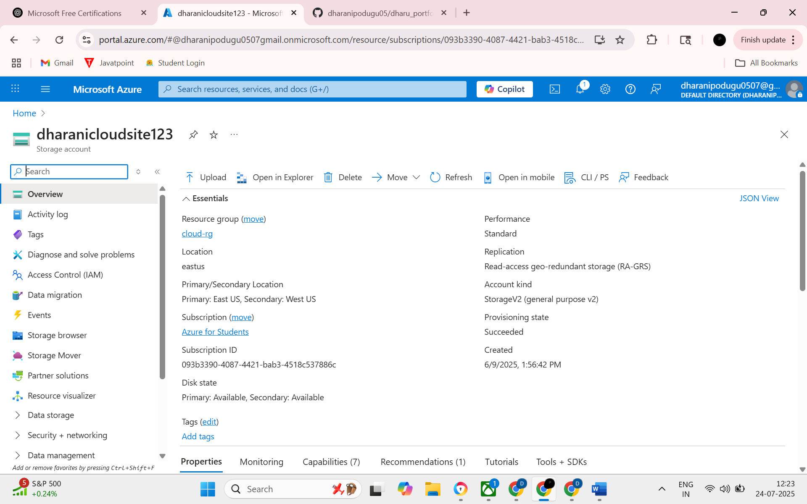

# dharu_portfolio
Deployed a static HTML website on Microsoft Azure using Blob Storage.
# 🌐 Azure Static Website Deployment

This project demonstrates how I deployed a static HTML website using **Microsoft Azure Blob Storage**.  
It serves as part of my learning journey in cloud computing and web hosting.

## 🔗 Live Website
[Click here to view the live site](https://dharanicloudsite123.z13.web.core.windows.net)

## 🧰 Tools & Technologies
- Microsoft Azure
- Azure Blob Storage
- Azure Portal
- HTML/CSS

## 📁 Project Structure

## 🚀 What I Learned
- How to create and configure a **Storage Account** on Azure  
- Enabling **Static Website Hosting**  
- Uploading and managing content through the **Azure Portal**  
- Accessing and sharing the website via a **public endpoint**

 ## 📸 Screenshots

### 1. Azure Storage Account Overview  

### 2. Static Website Configuration Enabled  

### 3. Live Website Hosted on Azure  

## 📄 License
This project is open for learning and showcasing purposes.

